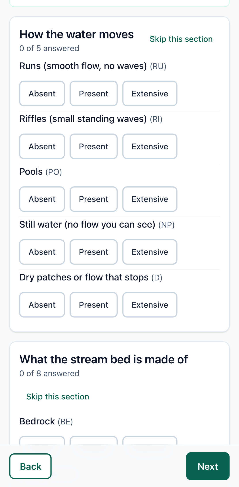
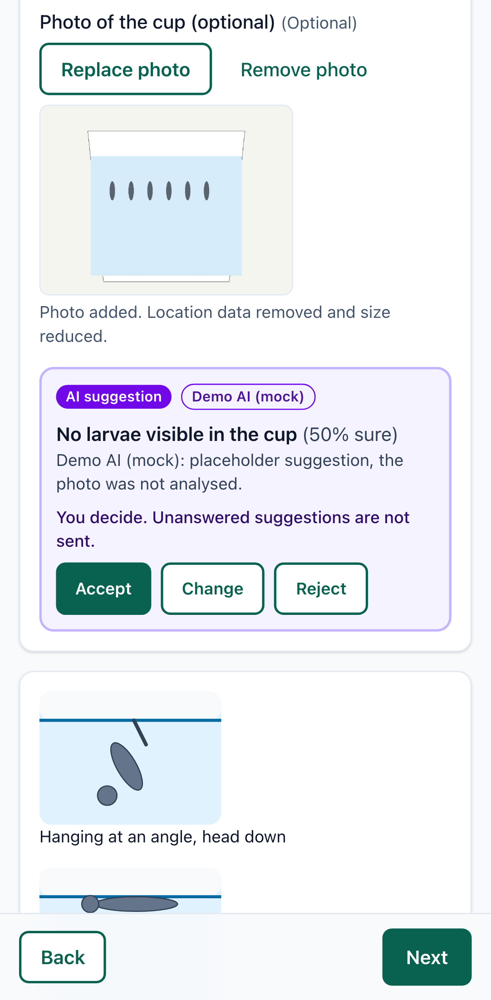
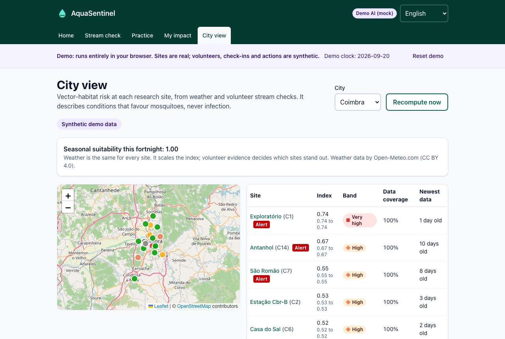
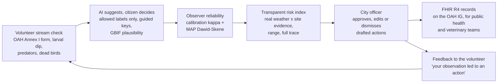

# AquaSentinel

**Citizen stream checks become a human-approved early warning for mosquito habitat, with records that public health and veterinary teams can use.**

OneAquaHealth IEEE Global Hackathon 2026. Built on the OneAquaHealth (OAH) field protocol, research sites, FHIR implementation guide, Catalogue of Measures and Policy Brief.

**Live demo, no install, works on a phone:** https://durgapritam.github.io/OneAquaHealth-IEEE/ &nbsp;·&nbsp; [Demo video script](docs/DEMO_SCRIPT.md) &nbsp;·&nbsp; [Claims and evidence](docs/CLAIMS.md) &nbsp;·&nbsp; [Status](docs/STATUS.md)

| Citizen check-in | AI suggestion the citizen must decide on | City view |
|---|---|---|
|  |  |  |

## The problem, in OneAquaHealth's words

The [OAH Policy Brief (2026)](https://doi.org/10.5281/zenodo.21476580) reports that:
- "Urban streams host insect communities (Diptera) of public health importance, including mosquito species that are vectors of West Nile virus, dengue, and chikungunya" (p.2).
- "Insectivorous birds, amphibians, and fish are natural control agents of insect disease vector populations. Poorer habitat conditions lead to the decline of these insect predators" (p.2).
- "Degraded urban streams are associated with higher cause-specific mortality and reduced life expectancy" (p.2).

It recommends to "incorporate Diptera monitoring from urban streams into national public health surveillance systems, using city-specific environmental baselines" (p.2), and says "integrated data systems are essential" (p.10).

Research traps run a few nights a year. AquaSentinel adds the frequent, cheap layer in between, and makes it trustworthy enough to act on.

## The loop



1. **Stream check.** Every Annex I field a volunteer can answer by eye, field for field from the [OAH field protocol](https://doi.org/10.5281/zenodo.20344421), plus three One Health modules: a five-cup larval dip with a resting-posture key, predators (frogs, insect-eating birds, bats), and dead birds with "do not touch" guidance. Works offline; photos lose EXIF on the device; positions are rounded to about 100 m; observers are random codes.
2. **AI assists, never decides.** Every suggestion is a chip with a confidence and a one-line reason that the citizen must accept, change or reject. Unanswered suggestions are never sent. Only labels in [data/labels.json](data/labels.json) survive, and dropped labels are shown. Larvae and adults are identified to type, never species. Dead birds are never sent to a model. Runs with no key (a clearly badged mock); Anthropic and Gemini providers are optional.
3. **Reliability.** A five-minute practice round scores each volunteer per question (Cohen's kappa) and explains their bias, for example "you tend to rate banks as natural when hard revetment is visible". A MAP Dawid-Skene model combines volunteers per site and week, seeded by calibration.
4. **Risk index.** `seasonal suitability (real Open-Meteo weather, cited WNV thresholds) x site conditions (reliability-weighted habitat, larvae, missing predators, dead-bird reports)`. Missing data widens a reported range and can never trigger an alert. Every score traces back to check-in ids, raw answers, posteriors and daily weather ([docs/RISK_MODEL.md](docs/RISK_MODEL.md)).
5. **Human-approved action.** Alerts draft actions mapped to sections and pages of the [OAH Catalogue of Measures](https://doi.org/10.5281/zenodo.20040211). A named officer must approve. If an officer picks a measure the Catalogue itself warns can create standing water (rain gardens, swales, ponds), AquaSentinel shows that warning.
6. **Interoperable records.** Findings, sites, pseudonymous observers, reliability, approved actions, volunteer messages and weekly summaries export as FHIR R4 transaction Bundles on the OAH IG profiles.
7. **Feedback.** Volunteers see what their observation led to, a campaign list of sites that need data, and a team leaderboard that rewards evidence quality, never volume.

## Evidence

| Claim | Result | Evidence |
|---|---|---|
| The weather part of the index is timely | Crossed the pre-registered threshold before the first human WNV case in **118 of 119** region-seasons (FR, IT; 2018 to 2023), median lead **8.0 weeks** | [eval/reports/backtest.md](eval/reports/backtest.md), plan committed first in [f389f25](https://github.com/DurgaPritam/OneAquaHealth-IEEE/commit/f389f25) |
| ...but weather alone cannot say where | It also crossed in **24 of 25** negative-control region-seasons (the five OAH city regions) | same report |
| Reliability weighting helps on small panels | Simulated: plain Dawid-Skene **loses** to majority vote with 1 to 3 observers; our calibrated MAP version beats it by up to **+10 points** (priors tuned on a separate seed) | [eval/reports/calibration.md](eval/reports/calibration.md) |
| Rankings are stable under weight changes | Spearman ≥ **0.97** for every ±50 % weight change | [eval/reports/sensitivity.md](eval/reports/sensitivity.md) |
| Records conform to the OAH IG | HL7 validator: **0 errors** on 20 valid files; **12 of 12** deliberately broken records rejected | [docs/evidence/validation-summary.md](docs/evidence/validation-summary.md) |
| Gaming the leaderboard does not pay | 50 low-quality check-ins earn **0** points; 20 repeats count once | [web/src/lib/__tests__/engagement.test.ts](web/src/lib/__tests__/engagement.test.ts) |
| Accessible | axe: **0 violations** on every screen, including colour contrast, on phone and desktop | [web/e2e/loop.spec.ts](web/e2e/loop.spec.ts) |
| The browser demo computes what the server computes | TypeScript ports of the risk engine and calibration reproduce Python on every site and factor | [data/fixtures/](data/fixtures/), [web/src/lib/local/__tests__/risk.test.ts](web/src/lib/local/__tests__/risk.test.ts) |

Tests: 142 pytest, 37 Vitest, 8 Playwright (4 flows × phone and desktop). CI runs all of them on every push.

## Hackathon tracks

| Track | How AquaSentinel addresses it |
|---|---|
| Citizen Science UX | Plain-language OAH questions with big tap targets, illustrations, offline queue, six languages (five machine-translated and flagged), under five minutes for the whole loop |
| Data-to-Insight | Reliability-weighted evidence becomes a traceable site index, weekly trends and a ranked city view |
| AI-Supported Assessment | Suggest-only AI with a fixed label list, a visible validation gate, guided keys, GBIF checks, no diagnosis, a no-key mock, and an eval script |
| Awareness and Storytelling | Every module explains its One Health link with a cited OAH page; volunteers hear what their observation led to |
| Community and Gamification | Tiers from calibration, campaigns from data gaps, team points per member for quality only |
| Resilience Informatics | Real-weather seasonal gate, pre-registered backtest against ECDC data, uncertainty ranges |
| Digital Health Standards | FHIR R4 on the OAH IG, validated with the HL7 validator, including negative tests |

## Honesty

**Real:** 106 research sites from the ENORA API; the OAH field-protocol questions; Open-Meteo weather; ECDC West Nile data (2018 to 2021, 2023); GBIF occurrences; OAH IG profiles and codes; OAH Catalogue sections and pages; OAH factsheet and Policy Brief quotations.

**Synthetic, and labelled `synthetic: true` in data and on screen:** all volunteers, check-ins, findings, risk scores built from them, actions and messages in the demo; the 19 calibration drawings (generated from their answers; they await review by the team panel, and no AI labelled them).

**Not claimed:**
- AquaSentinel does not predict disease or infection and never diagnoses a place, bird or person.
- The weights are written-down judgement, not fitted.
- The backtest tests only the weather part, because no historical citizen data exist.
- The vision eval uses the mock, so it measures nothing about model accuracy; no licensed expert-labelled photo set was available.
- The translations have not been reviewed by native speakers.

Open issues are in [docs/OPEN_QUESTIONS.md](docs/OPEN_QUESTIONS.md).

## Three findings for the OneAquaHealth project

1. **Weather tells you when, not where.** In our pre-registered backtest the weather-only signal preceded human WNV cases in 118 of 119 region-seasons, but also fired in 24 of 25 OAH city region-seasons without transmission. Site-level evidence (standing water, larvae, missing predators) is what can make the Policy Brief's "city-specific baselines" specific. The OAH Citizen Science App is well placed to supply it if it adds a larval dip and a predator module.
2. **Citizen data needs calibration before aggregation.** With the one to three volunteers per site and week that are realistic, plain Dawid-Skene aggregation did worse than majority vote in our simulation; a short calibration round used as a prior fixed it. We suggest a reference-image practice round in the OAH app, and publishing its question list so tools can align.
3. **Data plumbing issues we hit, with workarounds recorded:**
   - The OAH FHIR IG has no published package or CI build (build.fhir.org and packages.fhir.org return 404) and no licence file.
   - `ObservationIndicatorsOah` fixes `status = final`, so preliminary citizen data needs its own profile.
   - The IG has no codes for larval counts or dead-bird reports.
   - The ECDC 2020 West Nile file dates every first case in 2021.
   - The Policy Brief cites 100 sites where the API returns 106.

## Quick start

```bash
npm run setup      # Python 3.11 venv + Node dependencies
npm run seed       # 106 real sites + a labelled synthetic Coimbra season with real weather
npm run dev        # API on :8000 (API_PORT to change), web on :5173
npm test           # pytest + vitest
npm run validate   # HL7 validator against the OAH IG + our profiles (needs Java 11+)
npm run eval       # calibration simulation, sensitivity, backtest, vision eval
cd web && npm run e2e   # Playwright on the static build
```

No API keys are needed. To try a real vision model, copy `.env.example` to `.env` and set `AI_PROVIDER=anthropic` with `ANTHROPIC_API_KEY`, or `AI_PROVIDER=gemini` with `GEMINI_API_KEY` and `GEMINI_MODEL`.

The static demo (`cd web && npm run build:static`) runs the whole backend in the browser: TypeScript ports of the risk engine, Dawid-Skene, calibration, drafting and the mock AI, over a snapshot exported by `analysis/export_demo.py`.

## Repository

| Path | What |
|---|---|
| [api/](api/) | FastAPI, SQLModel. `ai/` providers and gate, `reliability/` kappa and Dawid-Skene, `risk/` index, `actions/` drafting, `fhir/` exporter |
| [web/](web/) | React, Vite, TypeScript, Tailwind PWA, Dexie offline queue, Leaflet, i18next. `src/lib/local/` is the in-browser backend |
| [fhir/](fhir/) | SUSHI profiles on the OAH IG, negative tests, validation scripts |
| [analysis/](analysis/) | calibration simulation, sensitivity, backtest, reference-set generator, exports |
| [data/](data/) | sites, questions, labels, keys, measures, reference set, ECDC files, golden fixtures |
| [docs/](docs/) | sources, risk model, claims, open questions, status, demo script, Devpost text |

## Credits and licences

Code: MIT. Data sources keep their licences ([docs/SOURCES.md](docs/SOURCES.md)):
- OAH documents: CC BY 4.0.
- ECDC: CC BY 4.0. "Dataset provided by ECDC based on data provided by public health authorities, scientific institutes or health care providers in the relevant reporting countries and/or by WHO."
- Weather data by Open-Meteo.com (CC BY 4.0).
- Map tiles: © OpenStreetMap contributors.
- GBIF occurrence data.
