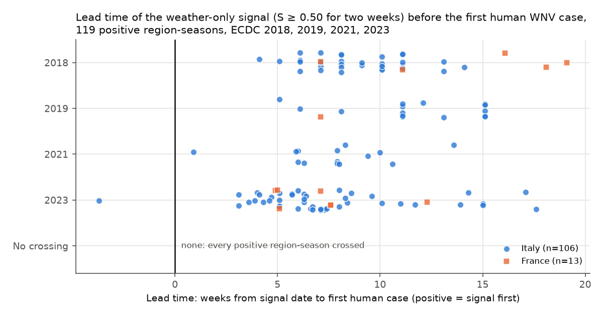
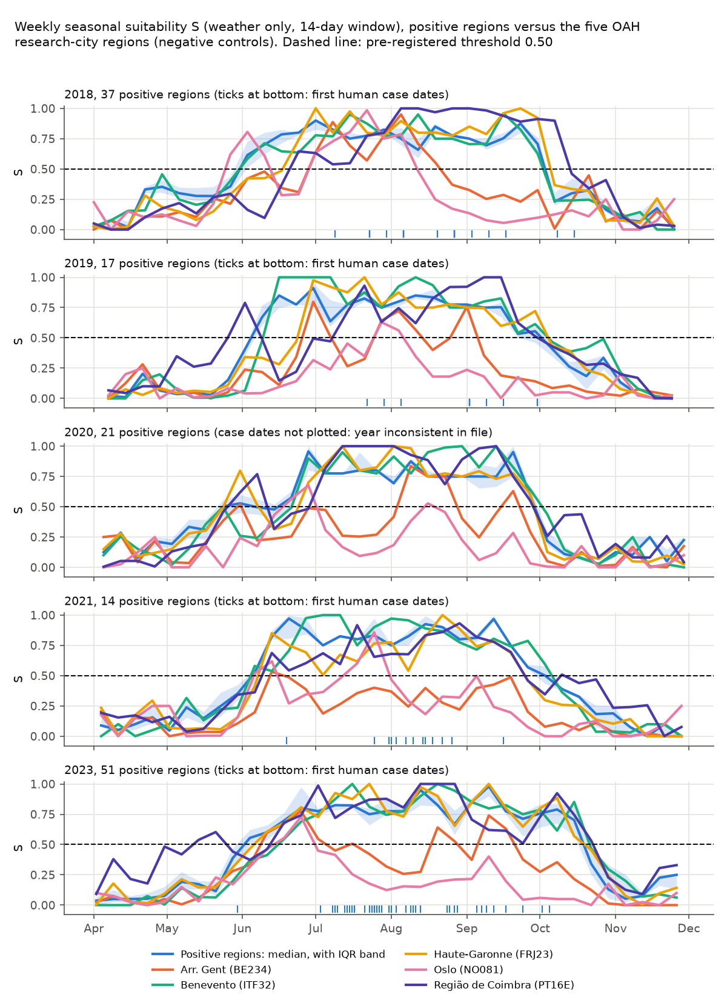

# Backtest: weather-only seasonal suitability against ECDC West Nile virus first-case dates

Pre-registered plan: [analysis/BACKTEST_PLAN.md](https://github.com/DurgaPritam/OneAquaHealth-IEEE/blob/a6b76a7/analysis/BACKTEST_PLAN.md), committed in [a6b76a7](https://github.com/DurgaPritam/OneAquaHealth-IEEE/commit/a6b76a7) before any weather was fetched or any index value computed. Generated by `analysis/backtest.py` (`npm run eval`). Real data; nothing here is synthetic.

## Limits (read first)

1. **First-case date only.** ECDC gives one first human case date per region-season, not weekly incidence (OQ-6). The column is "First human case reported"; the files do not say whether it is onset, diagnosis or notification, so lead times may include an unknown reporting delay.
2. **One point per region.** Each NUTS 3 region is represented by Open-Meteo reanalysis weather at its administrative seat. Several seats are coastal.
3. **Weather only.** No historical citizen data exist, so this tests only the seasonal gate of the index, not the site conditions that are meant to say *where* risk is.
4. **Thresholds from another species.** 14.3 °C and 109 degree-days come from *Culex tarsalis*; European transmission is mainly by *Culex pipiens* (OQ-9).
5. **Missing and faulty seasons.** 2022, 2024 and 2025 are not available (OQ-5). All 2020 first-case dates are in 2021 in the file (OQ-12), so 2020 positives are only in a labelled sensitivity check.
6. **Unbalanced positives.** 106 of 119 primary positive region-seasons are Italian, mostly in the Po valley. Portugal, Belgium and Norway have no positive region.
7. **Negative controls are not proven negatives**, and 25 region-seasons from five regions give an imprecise specificity estimate.
8. **Name matching for 2018 to 2020**; four regions have no NUTS code in the cached files.
9. **Not disease prediction.** Nothing here describes infection status of any place, bird or person. S describes weather that favours vectors.
10. **Region-seasons are not independent** (neighbouring provinces share weather and outbreaks), so the Mann-Whitney p-values are descriptive.

## Input hashes and deviations

| File | Pre-registered SHA-256 | Matches |
|---|---|---|
| `config/risk.yaml` | `7258cf66619ccfd0...` | yes |
| `api/risk/factors.py` | `3fdc304d1a3b98f9...` | yes |
| `api/risk/index.py` | `e2f06cd0af3ebf94...` | yes |
| `data/ecdc/wnv_2018.xlsx` | `3e88053d21e8d6a2...` | yes |
| `data/ecdc/wnv_2019.xlsx` | `c14c59418ab12a6b...` | yes |
| `data/ecdc/wnv_2020.xlsx` | `c86bf58f8c5f3408...` | yes |
| `data/ecdc/wnv_2021.xlsx` | `ec67b3eb4353c944...` | yes |
| `data/ecdc/wnv_2023.xlsx` | `706b3d9a7f3735a0...` | yes |

### Deviations from the pre-registered plan

- **Call path for S.** The plan said `api.risk.index.combine` would be called with the two weather factors only. `combine` divides by the total site weight, which is zero when no site factor is passed, so the script calls the production `api.risk.index.score_site` with weather only; the four site factors are then present with no data (value None), exactly as for a live site with no citizen data. S is the `season` value it returns (rounded to 4 decimals by the production code). This changes no weight, threshold or formula and cannot change S.

## Data

- Positive region-seasons analysed: 119 primary (2018 to 2023 without 2020) and 21 in the 2020 sensitivity check; negative-control region-seasons: 25 (five OAH research-city regions, 2018, 2019, 2020, 2021, 2023).
- Weekly values: 5753; weeks with no weather value: 0.
- Case dates re-read from the ECDC files and compared with `data/ecdc/backtest_regions.json`: 0 mismatches.
- Dataset provided by ECDC based on data provided by public health authorities, scientific institutes or health care providers in the relevant reporting countries and/or by WHO. Weather data by Open-Meteo.com (CC BY 4.0). Region points: Open-Meteo geocoding (GeoNames).

## Headline

- At the pre-registered threshold 0.50, 119 of 119 positive region-seasons produced a signal; 118 (99%, Wilson 95% 95% to 100%) had it strictly before the first human case. Median lead time 8.0 weeks (IQR 6.1 to 11.1).
- **Negative controls crossed the same threshold in 24 of 25 region-seasons.** S therefore has little or no specificity for where transmission happens; it behaves as a seasonal gate, as the plan expected.

## Table 1. Primary result, threshold 0.50

Signal date: the Sunday completing the second consecutive week with S ≥ 0.50. Lead time = first case date minus signal date. "Signal before case" counts misses and late signals as failures.

| Group | n | Crossed | Misses | Median lead, weeks (IQR) | Range, weeks | Signal before case (Wilson 95%) |
|---|---|---|---|---|---|---|
| All | 119 | 119 | 0 | 8.0 (6.1 to 11.1) | -3.7 to 19.1 | 118/119 = 99% (95% to 100%) |
| 2018 | 37 | 37 | 0 | 9.1 (7.1 to 11.1) | 4.1 to 19.1 | 37/37 = 100% (91% to 100%) |
| 2019 | 17 | 17 | 0 | 11.1 (11.1 to 15.1) | 5.1 to 15.1 | 17/17 = 100% (82% to 100%) |
| 2021 | 14 | 14 | 0 | 7.9 (6.1 to 9.1) | 0.9 to 13.6 | 14/14 = 100% (78% to 100%) |
| 2023 | 51 | 51 | 0 | 6.6 (5.1 to 8.4) | -3.7 to 17.6 | 50/51 = 98% (90% to 100%) |
| France | 13 | 13 | 0 | 7.6 (7.1 to 12.3) | 4.9 to 19.1 | 13/13 = 100% (77% to 100%) |
| Italy | 106 | 106 | 0 | 8.1 (6.1 to 11.1) | -3.7 to 17.6 | 105/106 = 99% (95% to 100%) |

Left-censored (already at or above 0.50 in the first April week): 0.

## Table 2. Negative controls, threshold 0.50

| Region | NUTS 3 | Season | Crossed | Signal date | Weeks at or above 0.50 | Seasonal maximum of S |
|---|---|---|---|---|---|---|
| Arr. Gent | BE234 | 2018 | yes | 2018-07-08 | 8 | 0.95 |
| Arr. Gent | BE234 | 2019 | yes | 2019-07-07 | 6 | 0.80 |
| Arr. Gent | BE234 | 2020 | yes | 2020-08-16 | 5 | 0.84 |
| Arr. Gent | BE234 | 2021 | no | n/a | 1 | 0.53 |
| Arr. Gent | BE234 | 2023 | yes | 2023-06-18 | 9 | 0.77 |
| Benevento | ITF32 | 2018 | yes | 2018-06-10 | 18 | 0.96 |
| Benevento | ITF32 | 2019 | yes | 2019-06-23 | 16 | 1.00 |
| Benevento | ITF32 | 2020 | yes | 2020-07-05 | 14 | 1.00 |
| Benevento | ITF32 | 2021 | yes | 2021-06-13 | 18 | 1.00 |
| Benevento | ITF32 | 2023 | yes | 2023-06-25 | 18 | 1.00 |
| Haute-Garonne | FRJ23 | 2018 | yes | 2018-07-01 | 15 | 1.00 |
| Haute-Garonne | FRJ23 | 2019 | yes | 2019-07-07 | 14 | 1.00 |
| Haute-Garonne | FRJ23 | 2020 | yes | 2020-06-07 | 16 | 1.00 |
| Haute-Garonne | FRJ23 | 2021 | yes | 2021-06-20 | 15 | 1.00 |
| Haute-Garonne | FRJ23 | 2023 | yes | 2023-06-18 | 19 | 1.00 |
| Oslo | NO081 | 2018 | yes | 2018-06-03 | 9 | 0.98 |
| Oslo | NO081 | 2019 | yes | 2019-08-04 | 2 | 0.63 |
| Oslo | NO081 | 2020 | yes | 2020-06-28 | 3 | 0.68 |
| Oslo | NO081 | 2021 | yes | 2021-06-13 | 4 | 0.86 |
| Oslo | NO081 | 2023 | yes | 2023-06-25 | 2 | 0.73 |
| Região de Coimbra | PT16E | 2018 | yes | 2018-07-01 | 16 | 1.00 |
| Região de Coimbra | PT16E | 2019 | yes | 2019-06-02 | 14 | 1.00 |
| Região de Coimbra | PT16E | 2020 | yes | 2020-06-07 | 15 | 1.00 |
| Região de Coimbra | PT16E | 2021 | yes | 2021-06-20 | 16 | 0.93 |
| Região de Coimbra | PT16E | 2023 | yes | 2023-05-21 | 21 | 1.00 |

Negative-control region-seasons that crossed: 24/25 = 96% (Wilson 95% 80% to 99%).

## Table 3. Contrast, positives versus negative controls (threshold 0.50)

| Measure | Positives median (IQR), n | Negative controls median (IQR), n | Mann-Whitney U | p (two-sided) |
|---|---|---|---|---|
| Weeks at or above 0.50 | 18 (17 to 20), 119 | 14 (6 to 16), 25 | 2560 | 1.11e-08 |
| Seasonal maximum of S | 0.97 (0.93 to 1.00), 119 | 1.00 (0.84 to 1.00), 25 | 1606 | 0.508 |

## Table 4. Secondary thresholds

### Threshold 0.30

| Group | n | Crossed | Misses | Median lead, weeks (IQR) | Range, weeks | Signal before case (Wilson 95%) |
|---|---|---|---|---|---|---|
| All | 119 | 119 | 0 | 11.1 (7.3 to 14.1) | -1.7 to 20.1 | 118/119 = 99% (95% to 100%) |
| 2018 | 37 | 37 | 0 | 14.1 (11.1 to 17.1) | 8.1 to 20.1 | 37/37 = 100% (91% to 100%) |
| 2019 | 17 | 17 | 0 | 12.1 (12.1 to 16.1) | 6.1 to 16.1 | 17/17 = 100% (82% to 100%) |
| 2021 | 14 | 14 | 0 | 9.2 (8.2 to 10.8) | 0.9 to 14.6 | 14/14 = 100% (78% to 100%) |
| 2023 | 51 | 51 | 0 | 7.4 (6.1 to 10.6) | -1.7 to 18.1 | 50/51 = 98% (90% to 100%) |
| France | 13 | 13 | 0 | 8.1 (7.1 to 18.1) | 5.9 to 20.1 | 13/13 = 100% (77% to 100%) |
| Italy | 106 | 106 | 0 | 11.1 (7.4 to 14.1) | -1.7 to 20.1 | 105/106 = 99% (95% to 100%) |

Negative controls crossing: 25/25. Left-censored positives: 0.

### Threshold 0.70

| Group | n | Crossed | Misses | Median lead, weeks (IQR) | Range, weeks | Signal before case (Wilson 95%) |
|---|---|---|---|---|---|---|
| All | 119 | 119 | 0 | 6.1 (4.3 to 10.0) | -7.1 to 16.1 | 114/119 = 96% (91% to 98%) |
| 2018 | 37 | 37 | 0 | 8.1 (6.1 to 10.1) | 3.1 to 16.1 | 37/37 = 100% (91% to 100%) |
| 2019 | 17 | 17 | 0 | 11.1 (10.1 to 14.1) | 2.1 to 15.1 | 17/17 = 100% (82% to 100%) |
| 2021 | 14 | 14 | 0 | 7.1 (5.9 to 8.3) | -1.1 to 13.6 | 13/14 = 93% (69% to 99%) |
| 2023 | 51 | 51 | 0 | 4.4 (2.9 to 6.2) | -7.1 to 14.1 | 47/51 = 92% (81% to 97%) |
| France | 13 | 13 | 0 | 5.1 (2.3 to 10.1) | -7.1 to 16.1 | 11/13 = 85% (58% to 96%) |
| Italy | 106 | 106 | 0 | 6.3 (4.4 to 9.8) | -4.7 to 15.1 | 103/106 = 97% (92% to 99%) |

Negative controls crossing: 18/25. Left-censored positives: 0.

## Table 5. 2020 sensitivity check (2020 dates assumed, not verified)

Case year set to 2020, month and day kept, threshold 0.50. Not part of the primary result.

| Group | n | Crossed | Misses | Median lead, weeks (IQR) | Range, weeks | Signal before case (Wilson 95%) |
|---|---|---|---|---|---|---|
| Italy 2020 | 21 | 21 | 0 | 11.1 (10.1 to 14.1) | 5.1 to 18.1 | 21/21 = 100% (85% to 100%) |

## Figures

Per-week values for every region-season: [backtest_weekly.csv](backtest_weekly.csv).

## What this shows and what it does not

- Pre-stated lead-time criterion met: median lead 8.0 weeks > 0 and 99% of positives signalled before the case.
- The weather gate is **not specific**: 24 of 25 negative-control region-seasons also crossed. A positive lead time here mostly reflects that summer arrives before cases do, not that S picks out places with transmission.
- Post hoc reading of Table 3 (not pre-registered): the difference in weeks at or above 0.50 comes from the two northern controls. Coimbra, Toulouse and Benevento had a median of 16 weeks, similar to the positives; Ghent and Oslo had 4. The contrast is consistent with the climate of the regions compared rather than with a transmission signal.
- This supports using S only as a multiplier ("is the season suitable?") and never alerting on weather alone, which is how the index is built (min_coverage in config/risk.yaml). It does not test the site factors, which need citizen data that do not exist for past seasons.

## Appendix. Every primary positive region-season, threshold 0.50

| Region | NUTS 3 | Season | First human case | Signal date | Lead, weeks |
|---|---|---|---|---|---|
| Alpes-Maritimes | FRL03 | 2018 | 2018-08-06 | 2018-06-17 | 7.1 |
| Bouches-du-Rhone | FRL04 | 2018 | 2018-10-08 | 2018-06-17 | 16.1 |
| Corse-du-Sud | n/a | 2018 | 2018-10-15 | 2018-06-10 | 18.1 |
| Pyrenees-Orientales | n/a | 2018 | 2018-10-15 | 2018-06-03 | 19.1 |
| Vaucluse | n/a | 2018 | 2018-09-03 | 2018-06-17 | 11.1 |
| Alessandria | ITC18 | 2018 | 2018-08-27 | 2018-06-10 | 11.1 |
| Asti | ITC17 | 2018 | 2018-08-27 | 2018-06-17 | 10.1 |
| Bergamo | ITC46 | 2018 | 2018-08-27 | 2018-06-17 | 10.1 |
| Bologna | ITH55 | 2018 | 2018-07-23 | 2018-06-10 | 6.1 |
| Brescia | ITC47 | 2018 | 2018-09-17 | 2018-06-10 | 14.1 |
| Como | ITC42 | 2018 | 2018-08-27 | 2018-06-17 | 10.1 |
| Cremona | ITC4A | 2018 | 2018-08-06 | 2018-06-10 | 8.1 |
| Cuneo | ITC16 | 2018 | 2018-08-27 | 2018-07-08 | 7.1 |
| Ferrara | ITH56 | 2018 | 2018-07-23 | 2018-06-10 | 6.1 |
| Forlì-Cesena | ITH58 | 2018 | 2018-08-20 | 2018-06-10 | 10.1 |
| Lodi | ITC49 | 2018 | 2018-08-27 | 2018-06-10 | 11.1 |
| Mantova | ITC4B | 2018 | 2018-08-27 | 2018-06-10 | 11.1 |
| Milano | ITC4C | 2018 | 2018-08-06 | 2018-06-10 | 8.1 |
| Modena | ITH54 | 2018 | 2018-07-09 | 2018-06-10 | 4.1 |
| Novara | ITC15 | 2018 | 2018-08-06 | 2018-06-10 | 8.1 |
| Oristano | ITG2G | 2018 | 2018-08-27 | 2018-06-10 | 11.1 |
| Padova | ITH36 | 2018 | 2018-07-23 | 2018-06-03 | 7.1 |
| Parma | ITH52 | 2018 | 2018-09-10 | 2018-06-10 | 13.1 |
| Pavia | ITC48 | 2018 | 2018-08-27 | 2018-06-10 | 11.1 |
| Piacenza | ITH51 | 2018 | 2018-08-27 | 2018-06-10 | 11.1 |
| Pordenone | ITH41 | 2018 | 2018-08-20 | 2018-06-10 | 10.1 |
| Ravenna | ITH57 | 2018 | 2018-08-06 | 2018-06-03 | 9.1 |
| Reggio nell'Emilia | ITH53 | 2018 | 2018-07-23 | 2018-06-10 | 6.1 |
| Rovigo | ITH37 | 2018 | 2018-07-09 | 2018-06-03 | 5.1 |
| Torino | ITC11 | 2018 | 2018-08-20 | 2018-06-17 | 9.1 |
| Treviso | ITH34 | 2018 | 2018-08-06 | 2018-06-10 | 8.1 |
| Udine | ITH42 | 2018 | 2018-08-06 | 2018-06-10 | 8.1 |
| Varese | ITC41 | 2018 | 2018-09-17 | 2018-06-17 | 13.1 |
| Venezia | ITH35 | 2018 | 2018-07-23 | 2018-06-03 | 7.1 |
| Vercelli | ITC12 | 2018 | 2018-08-06 | 2018-06-10 | 8.1 |
| Verona | ITH31 | 2018 | 2018-07-30 | 2018-06-10 | 7.1 |
| Vicenza | ITH32 | 2018 | 2018-07-23 | 2018-06-10 | 6.1 |
| Var | FRL05 | 2019 | 2019-07-29 | 2019-06-09 | 7.1 |
| Alessandria | ITC18 | 2019 | 2019-09-30 | 2019-06-16 | 15.1 |
| Asti | ITC17 | 2019 | 2019-09-02 | 2019-06-16 | 11.1 |
| Cuneo | ITC16 | 2019 | 2019-09-02 | 2019-07-07 | 8.1 |
| Macerata | n/a | 2019 | 2019-09-30 | 2019-06-16 | 15.1 |
| Mantova | ITC4B | 2019 | 2019-09-30 | 2019-06-16 | 15.1 |
| Modena | ITH54 | 2019 | 2019-09-02 | 2019-06-16 | 11.1 |
| Padova | ITH36 | 2019 | 2019-07-22 | 2019-06-16 | 5.1 |
| Parma | ITH52 | 2019 | 2019-09-02 | 2019-06-16 | 11.1 |
| Pordenone | ITH41 | 2019 | 2019-09-16 | 2019-06-16 | 13.1 |
| Rovigo | ITH37 | 2019 | 2019-09-30 | 2019-06-16 | 15.1 |
| Torino | ITC11 | 2019 | 2019-08-05 | 2019-06-23 | 6.1 |
| Treviso | ITH34 | 2019 | 2019-09-02 | 2019-06-16 | 11.1 |
| Venezia | ITH35 | 2019 | 2019-09-02 | 2019-06-16 | 11.1 |
| Vercelli | ITC12 | 2019 | 2019-09-30 | 2019-06-16 | 15.1 |
| Verona | ITH31 | 2019 | 2019-09-09 | 2019-06-16 | 12.1 |
| Vicenza | ITH32 | 2019 | 2019-09-02 | 2019-06-16 | 11.1 |
| Alessandria | ITC18 | 2021 | 2021-09-16 | 2021-06-13 | 13.6 |
| Bologna | ITH55 | 2021 | 2021-07-31 | 2021-06-06 | 7.9 |
| Cremona | ITC4A | 2021 | 2021-08-10 | 2021-06-13 | 8.3 |
| Ferrara | ITH56 | 2021 | 2021-08-26 | 2021-06-13 | 10.6 |
| La Spezia | ITC34 | 2021 | 2021-06-19 | 2021-06-13 | 0.9 |
| Mantova | ITC4B | 2021 | 2021-08-03 | 2021-06-20 | 6.3 |
| Milano | ITC4C | 2021 | 2021-08-14 | 2021-06-20 | 7.9 |
| Modena | ITH54 | 2021 | 2021-07-25 | 2021-06-13 | 6.0 |
| Padova | ITH36 | 2021 | 2021-08-01 | 2021-06-20 | 6.0 |
| Pavia | ITC48 | 2021 | 2021-08-22 | 2021-06-13 | 10.0 |
| Piacenza | ITH51 | 2021 | 2021-08-18 | 2021-06-13 | 9.4 |
| Pordenone | ITH41 | 2021 | 2021-07-31 | 2021-06-20 | 5.9 |
| Reggio nell'Emilia | ITH53 | 2021 | 2021-08-07 | 2021-06-13 | 7.9 |
| Venezia | ITH35 | 2021 | 2021-08-15 | 2021-06-20 | 8.0 |
| Alpes-Maritimes | FRL03 | 2023 | 2023-07-17 | 2023-06-11 | 5.1 |
| Bouches-du-Rhone | FRL04 | 2023 | 2023-08-03 | 2023-06-11 | 7.6 |
| Charente | FRI31 | 2023 | 2023-09-05 | 2023-06-11 | 12.3 |
| Charente-Maritime | FRI32 | 2023 | 2023-07-15 | 2023-06-11 | 4.9 |
| Gironde | FRI12 | 2023 | 2023-07-16 | 2023-06-11 | 5.0 |
| Haute-Corse | FRM02 | 2023 | 2023-07-27 | 2023-06-04 | 7.6 |
| Var | FRL05 | 2023 | 2023-07-31 | 2023-06-11 | 7.1 |
| Alessandria | ITC18 | 2023 | 2023-08-13 | 2023-06-18 | 8.0 |
| Asti | ITC17 | 2023 | 2023-07-25 | 2023-06-25 | 4.3 |
| Bari | ITF47 | 2023 | 2023-08-25 | 2023-06-04 | 11.7 |
| Bergamo | ITC46 | 2023 | 2023-08-10 | 2023-06-25 | 6.6 |
| Biella | ITC13 | 2023 | 2023-08-07 | 2023-07-02 | 5.1 |
| Bologna | ITH55 | 2023 | 2023-07-23 | 2023-06-11 | 6.0 |
| Brescia | ITC47 | 2023 | 2023-07-21 | 2023-06-11 | 5.7 |
| Como | ITC42 | 2023 | 2023-05-30 | 2023-06-25 | -3.7 |
| Cosenza | ITF61 | 2023 | 2023-09-07 | 2023-07-02 | 9.6 |
| Cremona | ITC4A | 2023 | 2023-07-09 | 2023-06-11 | 4.0 |
| Cuneo | ITC16 | 2023 | 2023-07-27 | 2023-07-02 | 3.6 |
| Foggia | ITF46 | 2023 | 2023-07-25 | 2023-06-04 | 7.3 |
| Forlì-Cesena | ITH58 | 2023 | 2023-08-28 | 2023-06-18 | 10.1 |
| Imperia | ITC31 | 2023 | 2023-08-27 | 2023-06-11 | 11.0 |
| Lecce | ITF45 | 2023 | 2023-09-12 | 2023-06-04 | 14.3 |
| Lodi | ITC49 | 2023 | 2023-07-08 | 2023-06-11 | 3.9 |
| Mantova | ITC4B | 2023 | 2023-07-14 | 2023-06-11 | 4.7 |
| Milano | ITC4C | 2023 | 2023-07-25 | 2023-06-11 | 6.3 |
| Modena | ITH54 | 2023 | 2023-07-03 | 2023-06-11 | 3.1 |
| Monza e della Brianza | ITC4D | 2023 | 2023-08-09 | 2023-06-11 | 8.4 |
| Novara | ITC15 | 2023 | 2023-07-28 | 2023-06-11 | 6.7 |
| Oristano | ITG2G | 2023 | 2023-07-28 | 2023-06-18 | 5.7 |
| Padova | ITH36 | 2023 | 2023-07-17 | 2023-06-11 | 5.1 |
| Parma | ITH52 | 2023 | 2023-07-10 | 2023-06-11 | 4.1 |
| Pavia | ITC48 | 2023 | 2023-07-25 | 2023-06-11 | 6.3 |
| Piacenza | ITH51 | 2023 | 2023-07-26 | 2023-06-11 | 6.4 |
| Pisa | ITI17 | 2023 | 2023-09-24 | 2023-06-11 | 15.0 |
| Pordenone | ITH41 | 2023 | 2023-10-02 | 2023-06-04 | 17.1 |
| Ravenna | ITH57 | 2023 | 2023-07-26 | 2023-06-04 | 7.4 |
| Reggio nell'Emilia | ITH53 | 2023 | 2023-07-17 | 2023-06-11 | 5.1 |
| Rovigo | ITH37 | 2023 | 2023-07-31 | 2023-06-11 | 7.1 |
| Salerno | ITF35 | 2023 | 2023-10-05 | 2023-06-04 | 17.6 |
| Sassari | ITG2D | 2023 | 2023-08-01 | 2023-06-18 | 6.3 |
| Taranto | ITF43 | 2023 | 2023-09-17 | 2023-06-04 | 15.0 |
| Torino | ITC11 | 2023 | 2023-07-17 | 2023-06-25 | 3.1 |
| Trapani | ITG11 | 2023 | 2023-08-01 | 2023-06-04 | 8.3 |
| Treviso | ITH34 | 2023 | 2023-07-23 | 2023-06-11 | 6.0 |
| Udine | ITH42 | 2023 | 2023-09-09 | 2023-06-04 | 13.9 |
| Varese | ITC41 | 2023 | 2023-08-11 | 2023-06-25 | 6.7 |
| Venezia | ITH35 | 2023 | 2023-07-24 | 2023-06-04 | 7.1 |
| Verbano-Cusio-Ossola | ITC14 | 2023 | 2023-08-24 | 2023-06-25 | 8.6 |
| Vercelli | ITC12 | 2023 | 2023-08-13 | 2023-06-18 | 8.0 |
| Verona | ITH31 | 2023 | 2023-07-17 | 2023-06-11 | 5.1 |
| Vicenza | ITH32 | 2023 | 2023-07-13 | 2023-06-11 | 4.6 |
