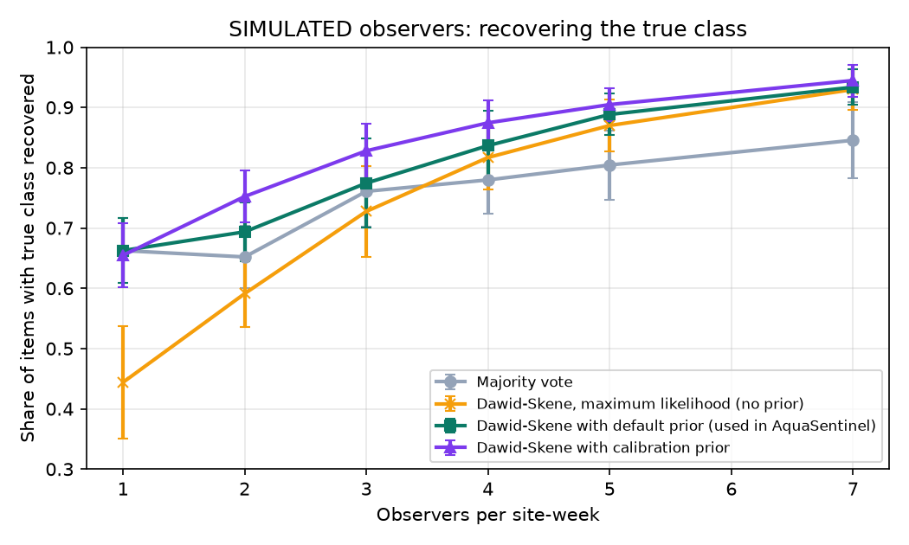

# Calibration simulation (SIMULATED DATA)

**Every number on this page comes from simulated observers. No real volunteer data is used.**

Generated by `python -m analysis.calibration_sim` (seed 2026, 30 repetitions, 120 items per repetition, pool of 40 observers).

## Set-up

- Three classes (absent, present, extensive), as on the OAH A/P/E scale. True class frequencies 40/35/25 %.
- Observer pool: 30 % careful (accuracy 0.85 to 0.95), 40 % average (0.6 to 0.8), 30 % biased: they report *present* or *extensive* hard banks as *absent* 80 % of the time (the bias the calibration feedback targets).
- Each observer also completes a simulated 15-item calibration round; its accuracy seeds the calibration prior (5 pseudo-observations).
- For each panel size k, every item is labelled by k observers drawn at random from the pool.

## Tuning disclosure

The two prior settings used by AquaSentinel (default accuracy 0.7 with 2 pseudo-observations; class prior share 1/3) were chosen from a grid (strength 2, 5, 10 by class pseudo-counts 0, 10, 40 on 120 items) on a **separate** run with seed 7 and 8 repetitions. The table below is a fresh run with seed 2026. The maximum-likelihood column shows what happens without the priors.

## Result

Mean ± standard deviation across repetitions of the share of items whose true class was recovered:

| Observers | Majority vote | Dawid-Skene, maximum likelihood (no prior) | Dawid-Skene with default prior (used in AquaSentinel) | Dawid-Skene with calibration prior |
|---|---|---|---|---|
| 1 | 0.663 ± 0.054 | 0.444 ± 0.094 | 0.663 ± 0.054 | 0.655 ± 0.054 |
| 2 | 0.652 ± 0.052 | 0.591 ± 0.056 | 0.694 ± 0.049 | 0.752 ± 0.044 |
| 3 | 0.761 ± 0.058 | 0.727 ± 0.076 | 0.774 ± 0.074 | 0.828 ± 0.045 |
| 4 | 0.780 ± 0.056 | 0.817 ± 0.053 | 0.837 ± 0.058 | 0.874 ± 0.037 |
| 5 | 0.804 ± 0.057 | 0.870 ± 0.043 | 0.888 ± 0.034 | 0.905 ± 0.028 |
| 7 | 0.846 ± 0.063 | 0.930 ± 0.033 | 0.934 ± 0.029 | 0.945 ± 0.027 |

## Reading it

- Plain maximum-likelihood Dawid-Skene did **worse** than majority vote with 1, 2, 3 observer(s) per site-week. With few labels per observer, EM overfits their confusion matrices. With single-label items the class prior can also collapse onto one class. This is why AquaSentinel uses MAP estimation with a default accuracy prior (0.7, 2 pseudo-observations) and a Dirichlet prior on the class distribution.
- 1 observer(s): Dawid-Skene with default prior +0.000, with calibration prior -0.008 versus majority vote.
- 2 observer(s): Dawid-Skene with default prior +0.042, with calibration prior +0.100 versus majority vote.
- 3 observer(s): Dawid-Skene with default prior +0.014, with calibration prior +0.067 versus majority vote.
- 4 observer(s): Dawid-Skene with default prior +0.057, with calibration prior +0.095 versus majority vote.
- 5 observer(s): Dawid-Skene with default prior +0.084, with calibration prior +0.100 versus majority vote.
- 7 observer(s): Dawid-Skene with default prior +0.088, with calibration prior +0.099 versus majority vote.

## Limits

- Simulated observers follow the model's own assumptions (independent errors given the true class). Real volunteers may copy each other, visit together, or drift over time.
- Site states are held fixed within a week; real streams change after rain.
- The biased group is a single, strong bias. Real biases will be weaker and more varied.

